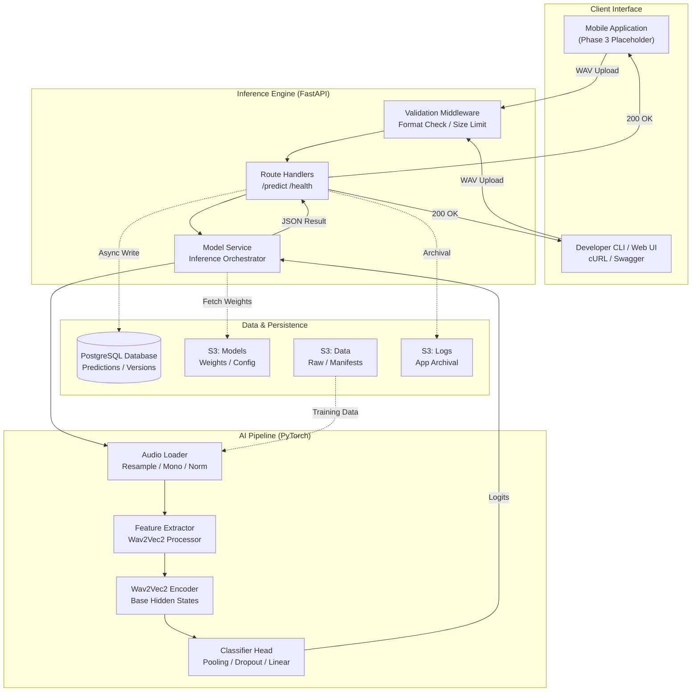
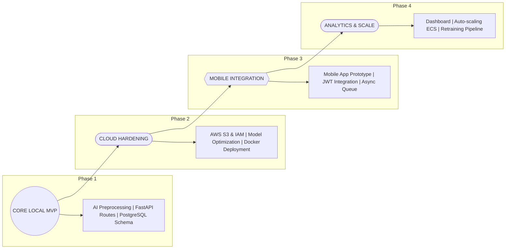
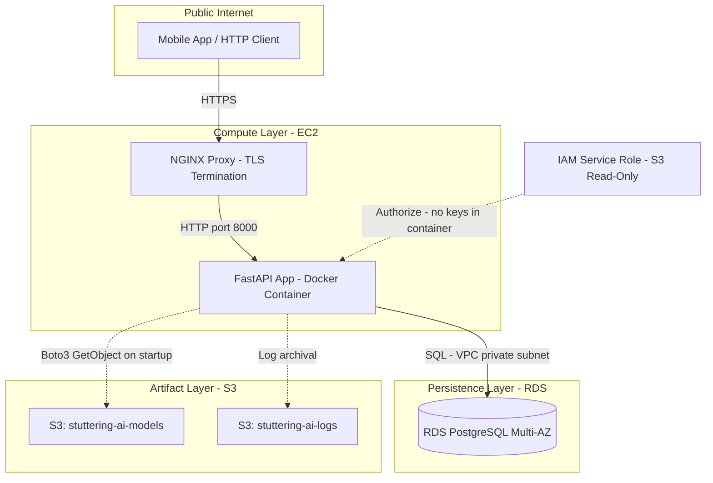

# Stuttering AI System — Architecture Document

**Task:** WAE-09

**Status:** Draft — Pending review by Ali, Adan, Saddouq, Wael

**Depends on:** SDQ-01 (API contract), WAE-01 (DB schema)

**Branch:** `feature/wae-architecture-docs`

**Directory:** `docs/`

---

## Table of Contents

1. [System Overview Diagram](#1-system-overview-diagram)
2. [Component Descriptions](#2-component-descriptions)
3. [Data Flow Narrative](#3-data-flow-narrative)
4. [Technology Stack](#4-technology-stack)
5. [Phase Progression](#5-phase-progression)
6. [Production Deployment Architecture](#6-production-deployment-architecture)

---

## 1. System Overview Diagram

The diagram below shows every component in the system and how they connect. Read it top-to-bottom: a client submits audio, the backend runs inference via the AI pipeline, the result is returned and logged, and cloud storage backs both the raw data and the trained model.

### Legend

| Symbol                | Meaning                     |
| --------------------- | --------------------------- |
| Solid arrow `→`    | Live request path (runtime) |
| Dashed arrow `-.->` | Offline / async path        |

---

## 2. Component Descriptions

### 2.1 AI Pipeline (`ai/`)

The AI pipeline is the core intelligence layer. It lives entirely inside the `ai/` directory and is imported by the backend service at startup — it is never invoked directly via HTTP.

**Preprocessing (`ai/preprocessing/`)**

`audio_loader.py` is the canonical entry point for every piece of audio in the system, whether it comes from training data or a live API request. It does four things in sequence: load the `.wav` file with `torchaudio`, resample to 16,000 Hz if needed, convert stereo to mono by averaging channels, and normalize amplitude. `augmentation.py` sits alongside it and is applied only during training — it adds Gaussian noise, time-shifts, or applies speed perturbation to improve robustness on the minority repetition classes. Neither file should ever be modified without updating `docs/preprocessing_rules.md` and getting sign-off from Adan, since the training and inference paths must stay identical.

**Dataset Layer (`ai/dataset/`)**

`stuttering_dataset.py` wraps the three manifest CSVs (train / val / test) produced by `split_dataset.py`. The `StutteringDataset` class and `get_dataloader` factory are used exclusively by `train.py` during training; the inference path in `model_service.py` handles single-sample loading directly. The 7-class label mapping `LABEL2ID / ID2LABEL` defined here is the single source of truth for label integers across the entire project.

**Model (`ai/models/`)**

`stuttering_classifier.py` defines `StutteringClassifier`, a thin wrapper over HuggingFace's `Wav2Vec2Model`. The encoder is pluggable — either `facebook/wav2vec2-base` (Phase 1 baseline) or `facebook/hubert-base-ls960` (ADN-06 comparison experiment). Mean pooling collapses the time dimension, then a dropout + linear layer projects to 7 logits. `ModelConfig` is a dataclass that drives all constructor arguments; nothing is hardcoded.

**Training (`ai/training/`)**

`train.py` is the entry point for all training runs. It reads a YAML config, builds the model and data loaders, runs the training loop with AdamW + linear-warmup LR schedule, saves checkpoints via `checkpoint_utils.py`, and writes a `training_log.csv` per experiment. The `export_model_for_inference()` function in `checkpoint_utils.py` produces the `model_inference.pt` + `config.json` pair that the backend service loads — this is the only handoff artifact between the AI team and Saddouq.

**Evaluation (`ai/evaluation/`)**

`evaluate.py` runs the held-out test set, computes all six metric types (accuracy, per-class P/R/F1, macro F1, weighted F1), generates the 7×7 confusion matrix heatmap, and writes `metrics.json`. Phase 1 acceptance thresholds live in `ACCEPTANCE_CRITERIA.md`: macro F1 ≥ 0.75, accuracy ≥ 0.70, no single class recall below 0.55 (with a lower 0.50 warning flag for the three repetition subclasses due to known data scarcity).

---

### 2.2 Inference API (`backend/`)

The FastAPI application is the single HTTP surface exposed to clients. It is stateless with respect to the AI model — the model is loaded once at startup into `app.state.model_service` and reused for every request.

**Application Foundation (`backend/app/`)**

`main.py` initialises the FastAPI app, wires CORS from environment config, registers the API router, and runs the lifespan context manager that loads `ModelService` on startup. `config.py` reads all configuration from environment variables via `pydantic-settings` — there is no config file with real values committed to the repo.

**Validation and Middleware (`backend/app/middleware.py`)**

Every request to `POST /predict` passes through `validate_audio_upload()` before reaching the route handler. It checks the RIFF magic bytes, validates the MIME type against the whitelist, and rejects files above `MAX_AUDIO_SIZE_MB`. `RequestLoggingMiddleware` logs a structured line (timestamp, method, path, status code, latency, request ID) for every request — this feeds into the S3 log archival in Phase 2.

**Route Handlers (`backend/api/routes.py`)**

Three endpoints as defined in `docs/api_contract.md`: `POST /predict`, `GET /health`, `GET /classes`. All handlers use FastAPI `Depends()` for model service and DB session injection, keeping the handler functions themselves thin. Custom exceptions from `ModelService` map to typed HTTP codes: `InvalidAudioError → 422`, `ModelNotLoadedError → 503`, `PredictionError → 500`.

**Model Service (`backend/services/model_service.py`)**

`ModelService.predict()` is the bridge between raw audio bytes and a structured prediction dict. It runs the same preprocessing steps as the training pipeline (via `audio_loader.py`), passes the waveform through `Wav2Vec2Processor`, calls the model's forward pass under `torch.no_grad()`, and applies sigmoid per class (NOT softmax — multi-label outputs are independent per-class probabilities and do not sum to 1.0). A `threading.Lock` guards any shared state for thread safety. The service supports loading the model artifact from a local path or from S3, controlled by the `MODEL_SOURCE` environment variable.

---

### 2.3 Database Layer (`backend/db/`)

PostgreSQL 15 stores every prediction and tracks which model version served it.

**Schema (defined in `WAE-01`, `backend/db/schema.sql`)**

Three tables: `model_versions` (tracks deployed artifacts, their S3 paths, and which is currently active); `predictions` (one row per API call, with a `JSONB all_scores` column storing the per-class sigmoid distribution, a FK back to `model_versions`, and a unique `request_id` UUID for idempotency); and `prediction_classes` (the multi-label child table — one row per detected class, with its own sigmoid `confidence`). Supporting indexes cover `predictions.created_at`, `predictions.model_version_id`, `prediction_classes.prediction_id` (load all classes for one prediction), and `prediction_classes.class_label` (analytics queries like "all predictions where `blocks` was detected"). See `docs/db_schema.md` for the full layout.

**ORM and CRUD (`backend/db/models.py`, `backend/db/crud.py`)**

SQLAlchemy 2.x with `asyncpg` driver. `create_prediction()` and `get_recent_predictions()` are the only two CRUD operations needed for Phase 1. All DB credentials come exclusively from environment variables — no defaults, no concatenated fallbacks.

---

### 2.4 Cloud Storage (`S3`)

Three buckets with strict least-privilege IAM policies defined in `WAE-05` / `WAE-06`:

* **`stuttering-ai-data`** — raw labeled `.wav` files organized by class under `raw/v1.0/`, plus processed manifests. Versioning enabled for dataset traceability.
* **`stuttering-ai-models`** — trained inference artifacts at `models/{version}/model_inference.pt` + `config.json`. Only the model-write IAM role (Adan's post-training upload) can write; the backend reads via the model-read role.
* **`stuttering-ai-logs`** — application log archival. Lifecycle rule: transition to Glacier at 90 days, expire at 365 days.

All buckets: private, SSE-S3 encryption, all public access blocked.

---

### 2.5 Mobile App (Phase 3 — Placeholder)

The mobile app is not implemented in Phase 1 or Phase 2. The `POST /predict` endpoint is designed to accept `multipart/form-data` from any HTTP client, so the mobile integration in Phase 3 requires no breaking API changes. The CORS configuration in `main.py` allows future mobile origins to be added via environment variable without code changes.

---

## 3. Data Flow Narrative

This section traces a single `.wav` file from the moment a client submits it to the moment a prediction response is returned and persisted. Follow this flow when debugging a live prediction or designing a test case.

**Step 1 — Client submits audio**

A client (mobile app, curl, or Swagger UI) sends an HTTP `POST` to `/api/v1/predict` with the audio file in a `multipart/form-data` body under the field name `audio_file`. The request carries a `Content-Type: multipart/form-data` header.

**Step 2 — Middleware validation**

Before the route handler touches the file, `validate_audio_upload()` in `middleware.py` reads the first 12 bytes of the upload stream and checks for the RIFF/WAV magic header (`52 49 46 46`). If the header is wrong, the request is rejected immediately with a `400 Bad Request` before any audio decoding happens. The middleware also checks the declared `Content-Length` against `MAX_AUDIO_SIZE_MB`; oversized files return `413 Request Entity Too Large`. `RequestLoggingMiddleware` records the incoming request at this point.

**Step 3 — Route handler receives the upload**

`POST /predict` in `routes.py` reads the validated `UploadFile`, extracts the raw bytes, generates a UUID `request_id`, and records the wall-clock start time for `processing_time_ms` calculation. It then calls `app.state.model_service.predict(audio_bytes)`.

**Step 4 — Preprocessing inside ModelService**

`model_service.py` passes the raw bytes to `audio_loader.load_audio()`, which decodes the WAV, resamples to 16,000 Hz if the source rate differs, converts stereo to mono by averaging channels, and returns a `float32` tensor. `normalize_waveform()` then applies peak normalization to bring amplitude into `[-1, 1]`. `pad_or_truncate()` enforces the fixed max-duration window the model was trained on — short clips are zero-padded at the end, long clips are truncated from the end.

**Step 5 — Feature extraction**

The normalized waveform tensor is passed to `Wav2Vec2Processor.__call__()`, which applies the same normalization the pre-trained model expects and returns an `input_values` tensor shaped `(1, sequence_length)`.

**Step 6 — Model inference**

`StutteringClassifier.forward(input_values)` runs inside `torch.no_grad()`. The Wav2Vec2 encoder produces hidden states shaped `(1, time_steps, 768)`. Mean pooling over `time_steps` collapses this to `(1, 768)`. Dropout and the linear classifier head project to `(1, 7)` logits. Softmax converts logits to probabilities summing to 1.0.

**Step 7 — Response assembly**

`ModelService.predict()` returns a dict with the v2 multi-label shape: `predicted_classes` (a list of `{class, confidence}` objects, one per class whose sigmoid probability crossed the server-side `threshold` — sorted by descending confidence, may be empty), `all_scores` (per-class sigmoid probabilities for all 7 classes keyed by class name — values do NOT sum to 1.0), `threshold` (the decision threshold actually applied), `processing_time_ms` (elapsed time from audio bytes received), and `model_version` (read from the loaded `config.json`). The route handler wraps this in a `PredictionResponse` Pydantic model. See `docs/api_contract.md` v2.0 for the wire schema.

**Step 8 — Database logging**

The route handler calls `crud.create_prediction()` with the prediction dict, `request_id`, client IP, audio filename, and audio duration. A new row is inserted into `predictions` with a FK to the currently active row in `model_versions`. This write is async — it does not add to the round-trip latency seen by the client.

**Step 9 — Response returned**

The HTTP `200 OK` response carries the `PredictionResponse` JSON body. `RequestLoggingMiddleware` records the final status code and total latency.

---

## 4. Technology Stack

All versions are pinned in `requirements.txt` (runtime) and `requirements-dev.txt` (dev/test tools). See `docs/environments.md` for the full environment matrix across local dev, CI, and production.

### Core Runtime

| Component          | Library / Service        | Version | Notes                                                |
| ------------------ | ------------------------ | ------- | ---------------------------------------------------- |
| Python             | CPython                  | 3.10.x  | Minimum 3.10 for `match` syntax and PEP 604 unions |
| Deep learning      | PyTorch                  | 2.x.x   | CPU for CI; CUDA optional for local/prod             |
| Audio I/O          | torchaudio               | 2.x.x   | Must match torch major version                       |
| Audio analysis     | librosa                  | 0.10.x  | Silence trimming, duration measurement               |
| Pretrained encoder | HuggingFace transformers | 4.x.x   | Wav2Vec2Model, Wav2Vec2Processor                     |
| Numerical          | NumPy                    | 1.24.x  |                                                      |
| Data splits        | scikit-learn             | 1.3.x   | StratifiedShuffleSplit, metrics                      |
| Visualizations     | matplotlib               | 3.7.x   | Confusion matrix heatmap, class distribution plots   |
| Data manipulation  | pandas                   | 2.x.x   | Manifest CSV I/O, inventory                          |

### Backend API

| Component     | Library / Service | Version | Notes                              |
| ------------- | ----------------- | ------- | ---------------------------------- |
| Web framework | FastAPI           | 0.10x.x | Async, OpenAPI/Swagger built-in    |
| ASGI server   | uvicorn[standard] | 0.2x.x  | With websockets and uvloop         |
| Settings      | pydantic-settings | 2.x.x   | Env-var config via BaseSettings    |
| File upload   | python-multipart  | 0.0.x   | Required by FastAPI for UploadFile |

### Database

| Component    | Library / Service | Version | Notes                                  |
| ------------ | ----------------- | ------- | -------------------------------------- |
| Database     | PostgreSQL        | 15      | `postgres:15-alpine` Docker image    |
| ORM          | SQLAlchemy        | 2.x.x   | Async ORM via `async_sessionmaker`   |
| Async driver | asyncpg           | 0.2x.x  | PostgreSQL async driver for SQLAlchemy |

### Cloud / Infrastructure

| Component           | Library / Service | Version | Notes                           |
| ------------------- | ----------------- | ------- | ------------------------------- |
| Cloud provider      | AWS               | —      | S3, EC2 (or ECS), RDS           |
| Object storage      | Amazon S3         | —      | 3 buckets: data, models, logs   |
| S3 client           | boto3             | 1.28.x  | Dataset and model artifact sync |
| Config format       | PyYAML            | 6.x     | Training experiment configs     |
| Containerisation    | Docker            | 24.x    | Single-service images           |
| Orchestration (dev) | Docker Compose    | 2.x     | `docker-compose.dev.yml`      |

---

## 5. Phase Progression

### What Each Phase Adds

**Phase 1 — Working local pipeline from raw audio to prediction with DB logging.** The model runs on CPU in a local Docker environment. No AWS dependencies. Every `POST /predict` call returns a structured JSON prediction and writes a row to local PostgreSQL.

**Phase 2 — Cloud-ready, hardened, and tuned.** Model artifacts live in S3 and are downloaded at container startup. IAM roles enforce least-privilege access. The best model from the ADN-06 / ADN-07 experiments replaces the Phase 1 baseline. Production middleware strips stack traces from error responses. The integration test suite gates all merges.

**Phase 3 — Mobile client.** The API contract is unchanged — the mobile app submits the same `multipart/form-data` payload. An authentication layer is added. Async inference queuing decouples client response time from model inference latency.

**Phase 4 — Observability and automation.** Monitoring surfaces model drift. Retraining pipelines are triggered automatically when new data arrives. The infrastructure scales horizontally.

---

## 6. Production Deployment Architecture

The production target for Phase 2 is an EC2 instance running Docker, backed by RDS PostgreSQL and S3. This is the minimum viable cloud deployment before mobile client integration.

### Deployment Checklist (Phase 2)

| Step | Action                                                                      | Owner   |
| ---- | --------------------------------------------------------------------------- | ------- |
| 1    | Build Docker image from `backend/Dockerfile`                              | Wael    |
| 2    | Push image to ECR (or deploy directly to EC2 via `docker pull`)           | Wael    |
| 3    | Set all env variables via AWS Secrets Manager or EC2 Parameter Store        | Wael    |
| 4    | Attach `stuttering-ai-model-read-role` as EC2 instance profile            | Wael    |
| 5    | Run `001_initial_schema.sql` migration against RDS (once per environment) | Wael    |
| 6    | Upload model artifact with `scripts/upload_model.py --version v1.0`       | Adan    |
| 7    | Start container — it downloads artifact from S3 on startup                 | Wael    |
| 8    | Verify `GET /health` returns `{"model_loaded": true}`                   | Saddouq |

### Security Notes

* TLS is terminated at nginx; the container never sees raw HTTPS.
* No AWS credentials are baked into the Docker image or committed to the repo. The EC2 instance profile provides S3 read access to the model bucket at runtime.
* `PRODUCTION_MODE=true` must be set in the EC2 environment — this suppresses stack traces and internal paths from all error responses.
* RDS is in a private VPC subnet; only the EC2 security group can reach port 5432.
* All three S3 buckets have public access blocked and use SSE-S3 encryption at rest.

---

*Document maintained by Wael. For questions about the AI pipeline sections, contact Ali or Adan. For API contract details, see `docs/api_contract.md`. For DB schema details, see `docs/db_schema.md`.*
